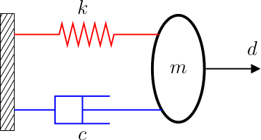
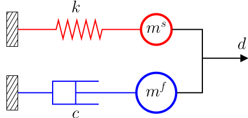

## Coupling schemes for Fluid-Structure Interaction

Understanding of various coupling schemes used for **Fluid-Structure Interaction (FSI)** is quite challening, consideirng especially that FSI problems often require high-fidelity simulations. However, efforts have been made to simplify the problem and gain some insights into the behaviour of different FSI coupling schemes. One such a simplified model is the well-known spring-mass-damper system which is recast as an FSI problem. Despite its simplicity, this problems serves as an useful model to understand the characteristics of FSI coupling schemes.

This repository provides a set of Jupyter notebooks on understanding various properties and solution behaviour of different coupling schemes used for FSI. Python scripts provide functions to calculate
* spectral radius of the amplification matrix which tells us a great deal about stability and numerical damping characteristics, and
* numerical solutions of the FSI problem with different coupling schemes.

Currently, monolithic scheme and staggered schemes based on
* Dirichlet-Neumann coupling,
* force and displacement predictors, and
* Backward Euler time integration scheme 

are covered. But the concepts can be extended to other types of schemes.